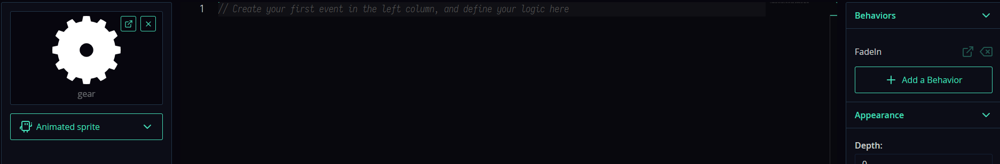

# Using behaviors
Behaviors are a pre-created set of functions/event handlers that can be assigned to different templates and rooms. They can be added and removed from the object during the game. They allow you to reduce and eliminate code duplication. Examples of use can be different effects, behavior and control of different characters, etc.
Consider the effect of the appearance of a template in a room:
1. Let's create a project.
2. Let's add 3 textures to it (circle, square and gear). For convenience, we'll put them in the `Texture` folder.


3.  Let's add the `Template` folder and create a template named `Circle` there, specifying the appropriate texture.


4. Let's create two more templates named `Gear` and `Rectangle` in the same way.


We add the appearance effect, i.e. when the template is created in the room. Let's make an animation of its increase in size (change the scale). To do this, we use the `tween` mod (do not forget to enable it in the project settings in the `Catmods` section).
Add the `Creation` event to the template and write the code there:

```js
// Setting the scale
this.scale.x = 0;
this.scale.y = 0;

// Setting up the animation
tween.add({
    obj: this.scale,
    fields: {
        x: 1,
        y: 1
    },
    curve: tween.easeInOutBack,
    duration: 1000,
    silent: true,
});
```

It should look like this:


Next, create a room and add a template to it. We launch it and get this effect.


Let's add this effect for other templates. We have 3 ways:
1. Copy this code into each template. This will entail duplication and if we want to change something, we will have to edit it everywhere.
2. Create a function to which the template will be passed. This method is not convenient in all cases, as we will see in the following examples.
3. Create a behavior and add it to the templates.

We will use the latter option.
1. Let's create a behavior for the template in the appropriate folder:
   


2. Let's call it `fadeIn`.
3. Add the `Creation` event and copy the code from the 'Circle` template there. We save it.


This means that this code will be executed when creating a template with this behavior. Now you need to assign the behavior to the template.

4. Deleting the `Creation` event in the `Circle` template.
5. Let's add the created `fadeIn` behavior to the template using the corresponding button in the interface.


6. Let's launch the project.
We get the same thing. But what is the convenience? The fact is that we can add this behavior to any template. Let's add it to the `Gear` and `Rectangle` templates.




Let's add these templates to the room and launch the project.


Now all three objects appear as they should, and we wrote the code only once. And if we change something in behavior, it will affect all the patterns at once.
## Dynamic addition and removal
Let's look at a more complex example, namely adding and removing behaviors during the game. Let's add a new behavior that will be responsible for managing the active character (and there will be three characters in total).
1. Let's add actions to control the character in the project settings.


2. Creating a behavior named `PlayerControl'. We write the code in it to process the movement with the `Frame start` event:

```js
// Move by X axis
this.x += 480 * u.time * actions.MoveX.value;
// Move by Y axis
this.y += 480 * u.time * actions.MoveY.value;
// Move
this.move();
```

As a result, we get the following.


3. Let's add the behavior to the `Circle` template and launch the project.


We control our character. To control another character, we need to remove the behavior from the current character and add it to another one. To do this, add a code to the room.
1. Let's add actions to switch the character first.


2. In the `Room start` event, we will save our characters to variables.

```js
this.tmpCircle = templates.list['Circle'][0];
this.tmpGear = templates.list['Gear'][0];
this.tmpRectangle = templates.list['Rectangle'][0];
```

3.  In the `Action down` event for the `PlayerCircle` action, we will specify the following code:

```js
// We check if it exists, then we delete it (if you try to delete something that does not exist, there will be an error)
if (behaviors.has(this.tmpGear, 'PlayerControl') === true) {
    behaviors.remove(this.tmpGear, 'PlayerControl');
}
if (behaviors.has(this.tmpRectangle, 'PlayerControl') === true) {
    behaviors.remove(this.tmpRectangle, 'PlayerControl');
}

// We check if it is not there, then add it (if you try to add it again, there will be an error)
if (behaviors.has(this.tmpCircle, 'PlayerControl') === false) {
    behaviors.add(this.tmpCircle, 'PlayerControl');
}
```

4. Let's add a similar code to the `Action down` events for the `PlayerGear` and `PlayerRectangle` actions.
5. Let's launch the project. Let's try to switch between characters and control them.


Everything works. But we can't see which character is currently selected. It's easy to fix. We will change the color of the active character. To do this, add the following code and events to the `PlayerControl` behavior:
1. Adding the `Creation` event code:

```js
this.tint = 0x58E875;
```

If the behavior in the editor is linked to a template, then the color of the active character will change when creating the template.

2. Let's add a special event for the behavior, which is called `Behavior added`. This event is executed when the behavior is added to the template during the game. Let's write the same code there:

```js
this.tint = 0x58E875;
```

Everything is fine, but if we leave it that way, then when switching, the color will remain that way. It is necessary to repaint the template back to white.

3. Let's add a special event for the behavior, which is called `Behavior removed`. It is executed when the behavior is removed from the template. Let's write the code there:

```js
this.tint = 0xFFFFFF;
```

As a result, our behavior has 4 events:


4. Let's launch the project.


As you can see, this is a very useful and simple mechanism that allows you to write code once and use it many times.
