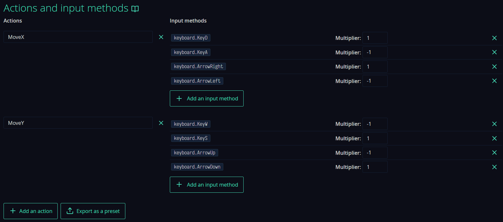
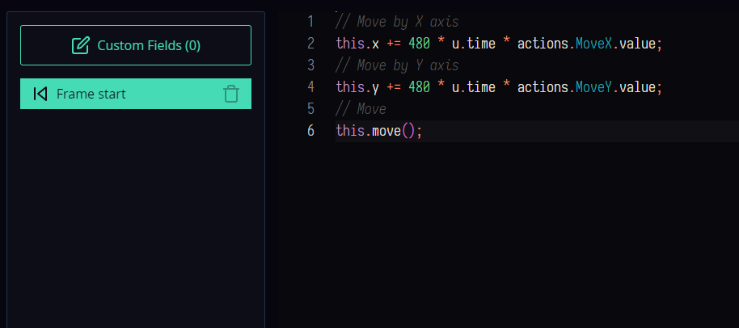
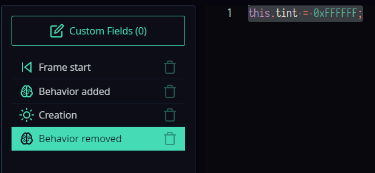

# Использование поведений
Поведения - это заранее созданный набор функций/обработчиков событий, который можно назначать разным шаблонам и комнатам. Их можно добавлять и удалять у объекта во время игры. Они позволяют сократить и исключить дублирование кода. Примерами использования могут быть различный эффекты, поведение ИИ, управление разными персонажами и т.п. 
Рассмотрим эффект появления шаблона в комнате:
1. Создадим проект.
2. Добавим в него 3 текстуры (круг, квадрат и шестерёнку). Для удобства поместим их в папку `Texture`.


3.  Добавим папку `Template` и создадим там шаблон с именем `Circle`, указав соответствующую текстуру.


4. Создадим аналогично ещё два шаблона с именами `Gear` и `Rectangle`.


Добавляем эффект появления, т.е. когда шаблон будет создаваться в комнате. Сделаем анимацию его увеличения в размере (изменим масштаб). Для это используем мод `tween` (не забудьте включить его в настройках проекта в разделе `Catmods`).
Добавляем у шаблона событие `Creation` и пишем там код:
```js
// Setting the scale
this.scale.x = 0;
this.scale.y = 0;

// Setting up the animation
tween.add({
    obj: this.scale,
    fields: {
        x: 1,
        y: 1
    },
    curve: tween.easeInOutBack,
    duration: 1000,
    silent: true,
});
```
Должно выглядеть так:


Далее создаём комнату и добавляем в неё шаблон. Запускаем и получаем такой эффект.


Добавим данный эффект для других шаблонов. У нас есть 3 пути:
1. Копировать данный код в каждый шаблон. Это повлечёт дублирование и если мы захотим что-то изменить, то надо будет править это везде.
2. Создать функцию, в которую будет передан шаблон. Не во всех случаях данный способ удобный, в следующих примерах мы это увидим.
3. Создать поведение и добавить его к шаблонам.

Мы воспользуемся последним вариантом.
1. Создадим поведение для шаблона в соответствующей папке:


2. Назовём его `FadeIn`.
3. Добавим событие `Creation` и копируем туда код из шаблона `Circle`. Сохраняем.


Это означает, что данный код  будет выполняется при создании шаблона с данным поведением. Теперь надо назначить поведение к шаблону.

4. Удаляем в шаблоне `Circle` событие `Creation`.

5. Добавим созданное поведение `FadeIn` к шаблону, используя соответствующую кнопку в интерфейсе.


6. Запустим проект.

Получаем тоже самое. Но в чём удобство?В том, что мы можем данное поведение добавить к любому шаблону.
Добавим его к шаблонам `Gear` и `Rectangle`. 


Добавим эти шаблоны в комнату и запустим проект.


Теперь все три объекты появляются как надо, а мы написали код только один раз. И если мы что-то изменим в поведении, то это повлияет сразу на все шаблоны.
## Динамическое добавление и удаление
Рассмотрим более сложный пример, а именно добавление и удаления поведения во время игры. Добавим новое поведение, которое будет отвечать за управление активным персонажем (а всего персонажей будет три).
1. Добавим в настройках проекта действия для управления персонажем.



2. Создаём поведение с именем `PlayerControl`. Прописываем в нём код для обработки движения в событии `Frame start`:
```js
// Move by X axis
this.x += 480 * u.time * actions.MoveX.value;
// Move by Y axis
this.y += 480 * u.time * actions.MoveY.value;
// Move
this.move();
```
В итоге, получаем следующее.



3. Добавим поведение к шаблону `Circle` и запустим проект.


Мы управляем нашим персонажем. Чтобы управлять другим персонажем нам нужно удалить поведение у текущего персонажа и добавить его другому. Для этого в комнату добавим код.
1. Добавим сначала действия для переключения персонажа.


2. В событии `Room start` сохраним в переменные наших персонажей.
```js
this.tmpCircle = templates.list['Circle'][0];
this.tmpGear = templates.list['Gear'][0];
this.tmpRectangle = templates.list['Rectangle'][0];
```
3.  В событии `Action down` для действия `PlayerCircle` мы укажем следующий код:
```js
// We check if it exists, then we delete it (if you try to delete something that does not exist, there will be an error)
if (behaviors.has(this.tmpGear, 'PlayerControl') === true) {
    behaviors.remove(this.tmpGear, 'PlayerControl');
}
if (behaviors.has(this.tmpRectangle, 'PlayerControl') === true) {
    behaviors.remove(this.tmpRectangle, 'PlayerControl');
}

// We check if it is not there, then add it (if you try to add it again, there will be an error)
if (behaviors.has(this.tmpCircle, 'PlayerControl') === false) {
    behaviors.add(this.tmpCircle, 'PlayerControl');
}
```
4. Добавим аналогичный код в события `Action down` для действий `PlayerGear` и `PlayerRectangle`.
5. Запустим проект. Попробуем переключаться между персонажами и управлять ими.


Всё работает. Но нам не видно какой персонаж сейчас выбран. Это легко исправить. Мы изменим цвет у активного персонажа. Для этого добавим следующий код и события в поведение `PlayerControl`:
1. Добавим событие `Creation` код:
```js
this.tint = 0x58E875;
```
Если поведение в редакторе привязано к шаблону, то при создании шаблона измениться цвет активного персонажа.

2. Добавим специальное событие для поведения, которое называется `Bahavior added`. Данное событие выполняется, когда поведение добавляем к шаблону во время игры. Напишем там тот же код:
```js
this.tint = 0x58E875;
```
Всё хорошо, но если мы так оставим, то при переключении цвет так и останется. Надо обратно перекрасить в белый цвет шаблон. 

3. Добавим специальное событие для поведения, которое называется `Behavior removed`. Оно выполняется, когда поведение удаляется у шаблона. Напишем там код:
```js
this.tint = 0xFFFFFF;
```
В итоге, у нашего поведения 4 события:



4. Запустим проект.


Как видно, поведения очень полезный и простой механизм, который позволяет написать код один раз, а использовать его множество раз.
